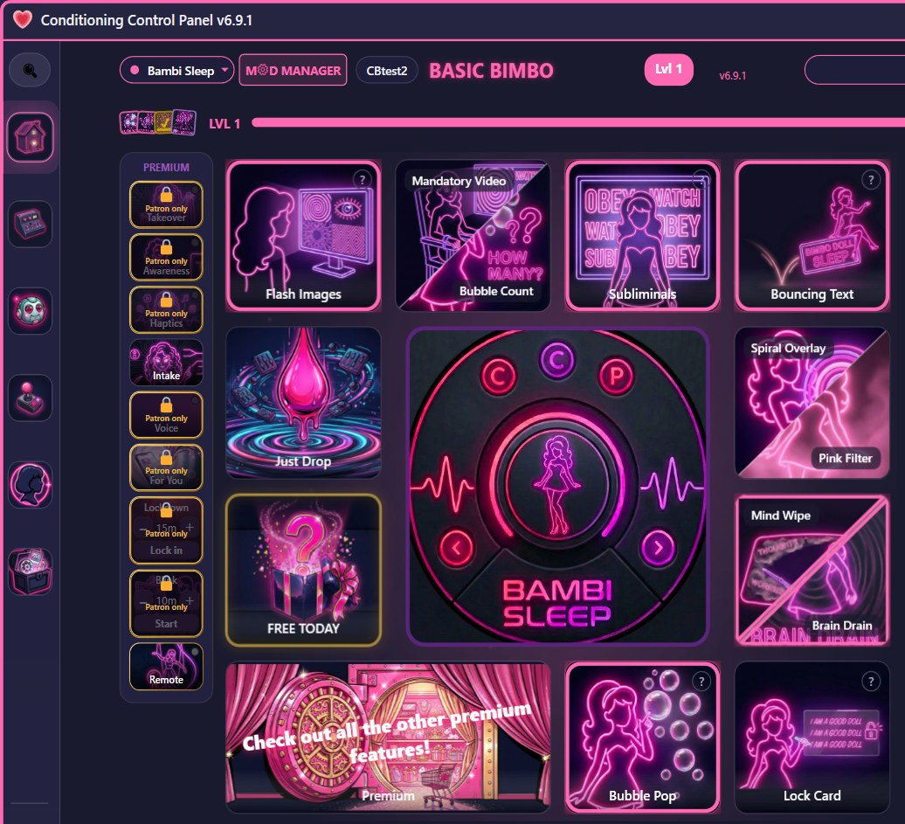

# Conditioning Control Panel

A Windows desktop app for visual and audio conditioning: flash images, mandatory videos, subliminals, screen overlays, a companion that talks back, and a progression layer that turns all of it into a game.


[](https://github.com/CodeBambi/Conditioning-Control-Panel---CSharp-WPF/releases/latest)
[](https://github.com/CodeBambi/Conditioning-Control-Panel---CSharp-WPF/actions/workflows/build.yml)

*A CC Labs LLC project* · [cclabs.app](https://cclabs.app) · [Discord](https://discord.gg/YxVAMt4qaZ) · [Patreon](https://www.patreon.com/CodeBambi)

<p align="center">
  
</p>

---

## About

The desktop client in this repository is open source under the MIT license. The backend it talks to (accounts, cloud sync, AI, content delivery, the shared leaderboard) is operated by **CC Labs LLC** and lives in a private repository.

Everything on the free floor works offline with a local assets folder. A free account adds cloud sync and the community features. Patreon tiers unlock the vault and the lab (see below).

---

## Features

### The free floor
Twelve core tools, no account required: flash images (GIF-aware, multi-monitor), mandatory fullscreen videos with attention checks, subliminal text and audio whispers, spiral overlay, pink filter, brain drain blur, bouncing text, bubble pop, phrase lock, mind wipe, the feed, and an embedded browser with per-page enhancement.

### Companion
An animated avatar that lives next to the panel or floats free on the desktop. Speech bubbles, idle chatter, spoken bark lines, trigger phrases, and a mod system that swaps her name, voice, art and personality. Six built-in personalities ship with the app; creators publish their own as `.ccpmod` packs (see [MODDING.md](MODDING.md)).

### Progression
XP and levels with feature unlocks, a skill tree, daily and weekly quests, 69 achievements, punch cards, a shared wallet across desktop, web and mobile, and a leaderboard. Since September 2026 progress is permanent: there are no seasonal wipes.

### Sessions and automation
Built-in and custom sessions with phased intensity, a scheduler with day-of-week selection, intensity ramps, autonomy mode, and remote control from any phone or browser through a session code plus PIN with three permission tiers.

### Tier 1: the velvet vault
For You (your library cut into an endless feed), blink trainer, takeover, she's listening (open mic with a safety word), graded intake, haptics for every toy you own, screen and typing awareness, and lockdown mode. AI chat through the companion with personality customisation and window awareness.

### Tier 2: the lab
Down the Rabbit Hole (a separate descent with its own economy), the Arcademy mini-game campus, the goon game (two players, one spiral), and on-device webcam gaze tracking with two mini-games built on it.

### Integration
Content packs, custom asset folders, nine UI languages, Discord rich presence, system tray with a configurable panic key, and an Android companion app in beta.

The current tier contents are listed at [cclabs.app](https://cclabs.app). The full walkthrough is the [Getting Started guide](https://cclabs.app/guide.html).

---

## Privacy

- Core features run entirely offline. Nothing leaves the machine unless you sign in.
- Window awareness sends the titles of your active windows and tabs to CC Labs servers for the companion to react to. It is opt-in and can be switched off at any time.
- Gaze tracking runs on your machine. Webcam frames never leave it.
- Local settings and data live in `%LOCALAPPDATA%\ConditioningControlPanel\`.
- No administrator rights are needed to install or run.

---

## Getting started

### Requirements
- Windows 10 or 11, 64-bit
- Nothing else. The app ships self-contained, and the installer adds the Visual C++ and WebView2 runtimes if they are missing

### Install
1. Download the latest `Setup.exe` from [Releases](https://github.com/CodeBambi/Conditioning-Control-Panel---CSharp-WPF/releases/latest)
2. Run it and follow the prompts
3. Launch **Conditioning Control Panel** from the Start menu

Updates are offered inside the app.

### Build from source
```bash
git clone https://github.com/CodeBambi/Conditioning-Control-Panel---CSharp-WPF.git
cd Conditioning-Control-Panel---CSharp-WPF
dotnet build ConditioningControlPanel.sln -c Release -p:ValidateExecutableReferencesMatchSelfContained=false
dotnet run --project ConditioningControlPanel
```

### First run
1. Drop images into `assets\images\` and videos into `assets\videos\` (the app creates the folders on first launch, or point it at your own folder in Settings)
2. Adjust frequencies, sizes and features on the dashboard
3. Press **START**
4. **Escape** stops everything. Press it twice to force-quit.

---

## Controls

| Action | Result |
|--------|--------|
| **Escape** (default) | Panic key, stops the engine |
| Double-tap the panic key | Force-quit the application |
| Click a flash image | Dismiss it (or spawn more in corruption mode) |
| Click a bubble | Pop it for XP |
| Double-click the avatar | Open AI chat (Patreon) |
| Right-click the avatar | Context menu |
| Drag the avatar | Reposition it when detached |

---

## Troubleshooting

**The app will not start.** Reinstall from the latest `Setup.exe`, which repairs the bundled runtimes. If it still fails, check `%LOCALAPPDATA%\ConditioningControlPanel\logs\crash.log`.

**Videos do not play.** Use `.mp4`, `.webm` or `.avi` files in `assets\videos\`.

**Flash images do not appear.** Check that `assets\images\` holds `.jpg`, `.png` or `.gif` files and that Flash Images is enabled on the dashboard.

**Something else.** Ask in [Discord](https://discord.gg/YxVAMt4qaZ) or open a report in the [bug tracker](https://github.com/CC-Labs-llc/ccp-bugs/issues).

---

## Contributing

Pull requests are welcome. Read [CONTRIBUTING.md](CONTRIBUTING.md) first: it covers the build, the test suite, the PR size limit and the review rules.

## Acknowledgments

- Video playback via [LibVLCSharp](https://github.com/videolan/libvlcsharp)
- Audio via [NAudio](https://github.com/naudio/NAudio)
- GIF support via [XamlAnimatedGif](https://github.com/XamlAnimatedGif/XamlAnimatedGif)
- Embedded browser via [WebView2](https://developer.microsoft.com/microsoft-edge/webview2/)

## License

[MIT License](LICENSE)

---

<p align="center">
  Built by <strong>CC Labs LLC</strong>
</p>
