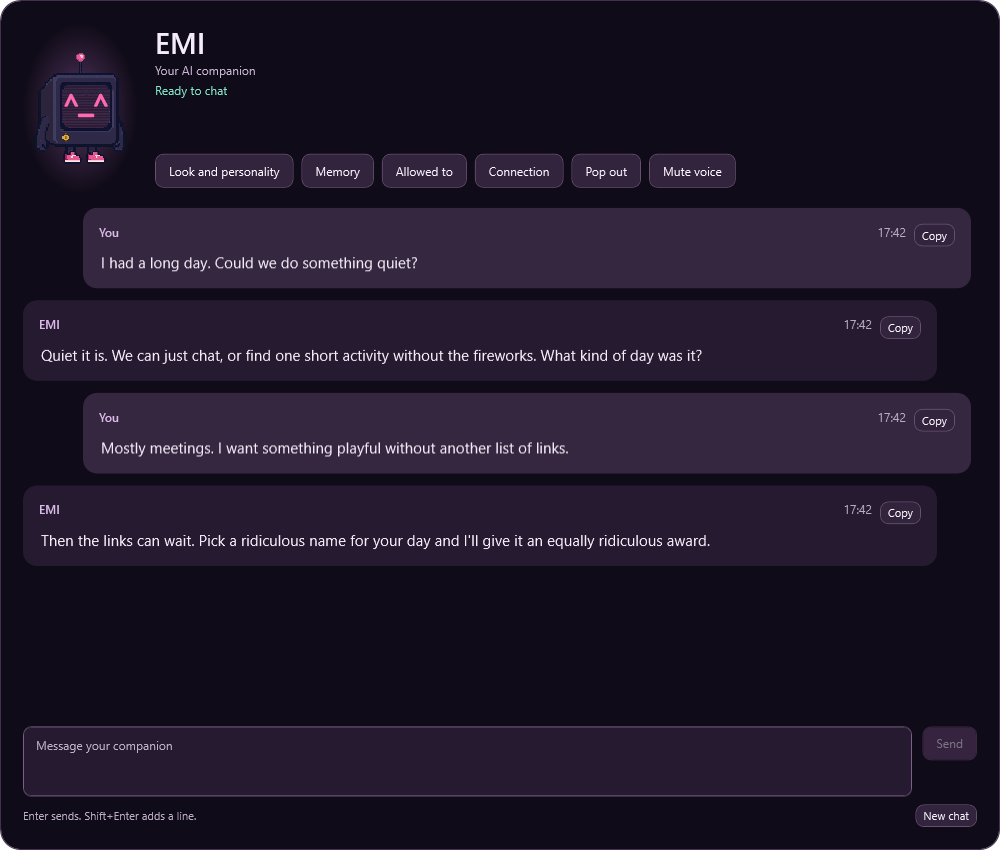
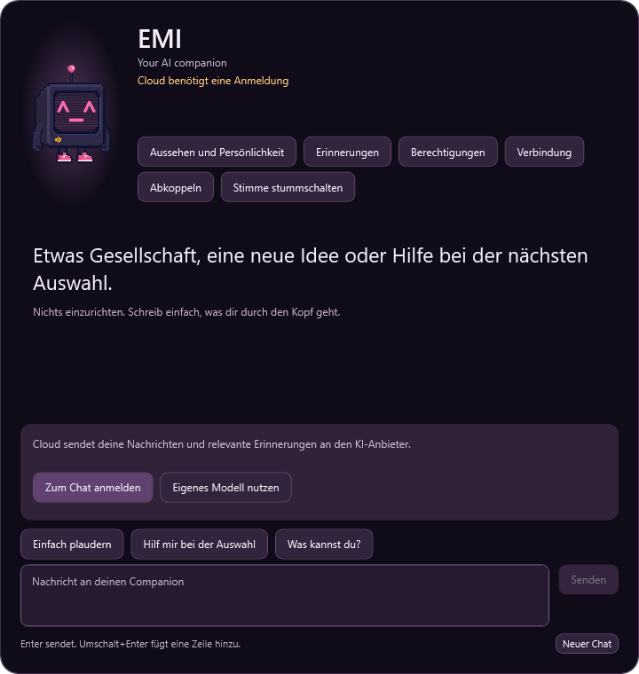

# Companion v2: implementation and release review

The companion preview makes conversation the main page and keeps configuration in focused sheets. It requires a Debug build with `CCP_COMPANION_V2=1`. Release builds retain the current experience. The separate server endpoint also defaults off. Nothing in this work enables or deploys the preview for existing players.

## What the player sees

- A persistent composer, shared conversation history, selectable replies, Copy, Stop, Retry, clear connection states, and three starting prompts.
- A Who sheet for look and perk selection, with personality copies in an expert editor. Existing avatars, mod identities and custom personalities remain supported. Appearance changes preserve the chosen perk, including the visible Leech XP cost.
- A Memory sheet with an editable preferred name, saved facts, and a readable, clearable conversation recap. Awareness controls have their own page.
- EMI's animated face and motion-aware particles on the conversation page, plus eight baked tube poses. The desk widget yields while the EMI tube is attached and visible, then restores its prior state.
- Cloud preselected on fresh preview installs. The first chat requests sign-in when needed. Existing Local, custom-provider and Off choices remain intact.
- Suggested mod presets remain suggestions until the player explicitly selects them. Opening a mod does not silently save a suggestion as a preference.

The intended voice is an earnest, literal CRT with a notebook, gel pens, gold stars, and bad robot impressions. EMI answers the actual message; the joke is usually on EMI's own plans. Serious conversation drops the comic bit. These are authored examples, not claimed evaluation outputs:

> i had a plan. it involved a clipboard. we can ignore it.

> you did the difficult bit. i supervised the gold star.

> quiet it is. my dramatic entrance can wait.

Changing personality creates an editable named copy and preserves the original. Character text does not copy credentials or effect permissions. The default EMI voice applies only to CCP Default's neutral companion; other selected voices remain authoritative.

## Engagement through continuity and useful replies

The prompt prioritizes the player's latest preference over character opinions. It answers directly, allows a brief playful beat, and does not require a follow-up question. Media appears only when requested. There are no unsolicited links, automatic training detours, invented actions, or canned replies presented as successful AI output.

Familiarity progresses through New, Getting familiar and Easy company from accepted conversations. It has no daily streak, decay, intimacy lock or punishment for leaving. The next meaningful improvement is measuring whether users get a useful first reply and choose to return, rather than increasing message count at any cost.

Memory has two bounded mechanisms. Explicit requests such as a preferred name, favourite or goal become conservative local facts; corrections retire stale facts. After eight accepted exchanges, with memory enabled, one background provider request can select exact excerpts for a short recap. It runs under the same budget, has no automatic retry, yields to foreground conversation, and cannot execute effects. The recap remains visible and clearable. Relevant older turns can also be recalled lexically within a small token allowance, without a model call.

## Reliability and privacy

Each interactive turn makes one generation attempt. Empty, malformed, filtered, truncated, cancelled and stale responses have distinct failure handling. Failed turns are removed and recoverable drafts remain available. Effect commands run only after an accepted reply and a final context check. Conversation text is not written to diagnostic logs.

The preview verifies protocol version, request identity and completion status on its separate endpoint. An older server cannot silently process it through the legacy route. Quota and pending replies are account-scoped. Memory and conversation files use separate account directories; switching accounts invalidates pending work and clears stale UI state. Existing unscoped history files are preserved without guessing their owner.

The private server reserves spending atomically before a call, settles actual provider cost, limits provider prices, and conservatively retains reservations when billing is uncertain. Background work earns at most one attempt per eight successful chats. Explicit budget allocation is required because legacy clients and other AI consumers share the owner's overall allowance.

## Review evidence

The engineering work includes deterministic coverage for protocol mismatch, quota ownership, duplicate and obsolete work, cancellation, forgetting, account isolation, explicit corrections, summary grounding, foreground priority, perk migration and EMI visibility rules. The complete client suite passed: 8,616 passed, 0 failed, 1 skipped. Debug and Release builds succeeded with 0 errors. The compiled Release gate returned false even with the preview switch set. After the final UI fixes, all 58 targeted and WPF construction checks passed. A clean Debug rebuild regenerated matching markup and code after an incremental build exposed a stale control type; the final Who sheet was then reopened successfully. Existing compiler warnings remain. The private server companion suite passed all 31 checks. The server's broader run retained two baseline failures in each of its descent and justdrop suites, plus a Windows test-runner teardown failure; these are recorded in its private review, not counted as clean checks.

The UI is rendered offscreen using real WPF controls and localized text at 720 and 1000 pixels, in English and German. This avoids starting the normal application or touching its profile. It covers 32 first-visit, conversation, waiting, error-recovery and sheet renders. These use fictional dialogue and isolated fixture state, not a live provider or a real player profile. The visual review found and corrected message separation, an inert-looking composer, bright disabled controls, inherited untranslated labels, and misleading Cloud-cap wording.

A bounded comparison used only fictional inputs and the actual compiled prompt, across seven model candidates. After correcting a preference-priority conflict, Hermes 4 passed six core cases and six fresh holdouts for corrected preferences, names, natural exits, completed tasks, and truthful capabilities. The 72 paid requests totalled about USD 0.04. This small evaluation identifies a promising candidate, not an industry-leading quality claim or a cost saving. No production model was changed.

## Release gates

1. Review the combined desktop experience, keyboard flow, tube/desk native visibility and preserved preferences in a disposable profile. Offscreen screenshots cannot prove real window lifecycle behavior.
2. Run the server reservation scripts against disposable real Redis. Pure/Lua fixture tests do not establish network and Redis integration.
3. Reconcile all deployed AI consumers and choose an explicit weekly v2 allocation within the whole-account budget. The measured candidate costs more per tested request than the old model; shorter prompts alone do not prove lower weekly spend.
4. Decide how users can explicitly adopt preserved legacy history. Do not silently assign unscoped local memories to whichever account signs in first.
5. Broaden conversation evaluation across all avatars, supported languages and long sessions, including refusal and interrupted responses. Current automatic fact extraction deliberately recognizes a narrow set of English explicit requests; manual memory editing works independently.
6. Build-check the individual draft PR cuts before merging; the tested assembled tip is the integration result, not evidence that every intermediate cut was separately compiled. Owner review and the next client release. Release activation is a separate, deliberate change. Draft PRs imply neither merge nor deployment.

Streaming and semantic search are not implemented. The complete-response approach lets moderation and formatting finish before display; the tradeoff is a wait before any reply text appears. Improving those paths is justified only by measured latency or recall failures.

## Preview images

These are actual WPF renders with fictional dialogue and fixture state.

